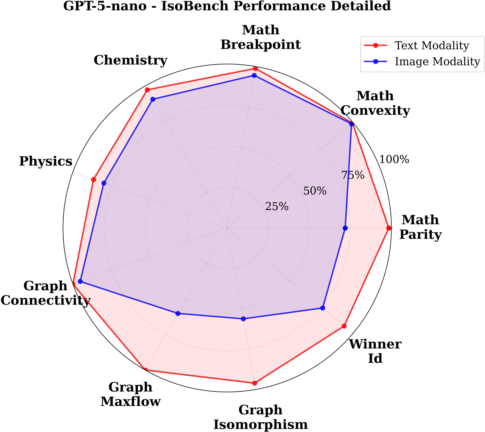

# IsoBench: Benchmarking Multimodal Foundation Models on Isomorphic Representations

[](https://arxiv.org/pdf/2404.01266)
[](https://huggingface.co/datasets/isobench/IsoBench)

Evaluating multimodal foundation models on isomorphic representations - the same underlying problem presented in both text and image modalities to assess true reasoning capabilities beyond modality-specific biases.


## Results Preview

### GPT-5-nano and Gemini-2.5-Flash Performance Across Task Categories

<div style="display: flex; justify-content: space-between;">
   <div style="flex: 1; text-align: center;">
      
      <p>GPT-5-nano</p>
   </div>
   <div style="flex: 1; text-align: center;">
      
      <p>Gemini-2.5-Flash</p>
   </div>
</div>

*GPT-5-nano and Gemini-2.5-F;ash performance on IsoBench macro-task categories. Red indicates text modality performance, blue indicates image modality performance. The framework reveals consistent gaps between text and image reasoning across all task domains.*

## Overview

IsoBench is a benchmark dataset designed to evaluate multimodal reasoning capabilities of foundation models. This framework provides:

- **Modular Design**: Separate components for each model and task type
- **Multi-Modal Support**: Both image and text modality evaluation
- **Comprehensive Tasks**: Mathematics, science, algorithms, and games
- **Detailed Reporting**: Per-task and aggregate performance metrics
- **Easy Configuration**: Command-line interface with sensible defaults

## Features

- ✅ **Multiple Foundation Models**: OpenAI GPT (including GPT-5 default), Google Gemini, Anthropic Claude
- ✅ **Complete Task Coverage**: All IsoBench tasks across 4 domains  
- ✅ **Dual Modality**: Text and image representation evaluation
- ✅ **Enhanced Reporting**: Macro-task summaries with detailed performance breakdowns
- ✅ **Professional Visualizations**: Radar plots with dual-modality comparisons
- ✅ **Flexible Configuration**: Command-line arguments for customization
- ✅ **Results Export**: Enhanced JSON and CSV output formats
- ✅ **Table 1 Reproduction**: Generate detailed reports similar to the original paper
- ✅ **Resume Functionality**: Skip completed evaluations with intelligent caching
- ✅ **Comprehensive Logging**: Detailed JSON logs with full evaluation traces
- ✅ **Multi-Model Aggregation**: Compare multiple models with dedicated aggregation script
- ✅ **Long Prompt Support**: Use detailed prompts from paper appendix for better results

**Important**: Currently only GPT models have been thoroughly tested. Gemini and Anthropic implementations are included but not fully validated.

## Installation

### Prerequisites

- Python 3.8 or higher
- Required Python packages (install via pip):

```bash
pip install openai google-generativeai anthropic datasets pandas numpy pillow
```

### Setup

1. Clone this repository:
```bash
git clone <repository-url>
cd IsoBench-Eval
```

2. Install dependencies:
```bash
pip install -r requirements.txt  # We'll create this
```

3. Set up API keys as environment variables:
```bash
export OPENAI_API_KEY="your-openai-api-key"
export GEMINI_API_KEY="your-gemini-api-key"  # or GOOGLE_API_KEY
export ANTHROPIC_API_KEY="your-anthropic-api-key"
```

## Usage

### Basic Usage

Run evaluation with GPT-5 (default model):
```bash
python eval.py
```

### Command Line Options

```bash
python eval.py [options]

Options:
  --model MODEL         Model to evaluate (default: gpt-5)
                       Options: gpt-5, gpt-4, gemini-2.0-flash-exp, gemini-1.5-pro, claude-3-opus
  --tasks TASKS         Specific tasks to evaluate (default: all tasks)
  --modalities {text,image}  Modalities to evaluate (default: text image)
  --max-samples N       Maximum samples per task (default: all samples)
  --output-dir DIR      Output directory for results (default: isobench_results)
  --long-prompts        Use detailed prompts from paper appendix (default: short prompts)
  --short-prompts       Use concise prompts for faster evaluation
  --save-detailed-results   Save detailed results to JSON file
  --generate-radar-plots    Generate radar plot visualizations (default: True)
  --no-radar-plots      Disable radar plot generation
  --resume              Resume from cached results if available (default: True)
  --no-resume           Don't resume from cached results
  --fresh-start         Override cached results and start fresh evaluation
  --api-key KEY         API key for the model (can also use env vars)
  --parser-model MODEL  Choice parsing model (default: gpt-3.5)
                       Options: gpt-3.5 (OpenAI GPT-3.5-turbo), gemini-2.5-flash-lite (Google Gemini with structured output)
  --verbose             Enable verbose logging
  --help               Show help message
```

### Example Commands

1. **Full evaluation with GPT-5** (default):
```bash
python eval.py
```

2. **Evaluate specific tasks with GPT-4**:
```bash
python eval.py --model gpt-4 --tasks math_parity math_convexity chemistry
```

3. **Quick test with limited samples**:
```bash
python eval.py --model gemini-2.0-flash-exp --max-samples 50
```

4. **Text modality only**:
```bash
python eval.py --modalities text --output-dir text_only_results
```

5. **Use long prompts (paper appendix style)**:
```bash
python eval.py --long-prompts
```

6. **Resume previous evaluation**:
```bash
python eval.py --model gpt-4 --resume
```

7. **Fresh start (clear cache)**:
```bash
python eval.py --model gpt-4 --fresh-start
```

8. **Combine multiple options**:
```bash
python eval.py --model claude-3-opus-20240229 --tasks math_parity graph_connectivity --long-prompts --max-samples 100 --verbose
```

9. **Use Gemini parser for choice extraction**:
```bash
python eval.py --model gpt-5 --parser-model gemini-2.5-flash-lite
```

## Enhanced Functionality

### 🎯 Comprehensive Evaluation Summaries
The framework now generates enhanced evaluation summaries with:
- **Macro-task groupings**: Results organized by Math, Science, Algorithm, and Game categories
- **Detailed modality breakdown**: Per-task and per-modality accuracy reporting
- **Performance gap analysis**: Text vs. Image modality performance gaps
- **Sample count tracking**: Total and correct sample counts for transparency

### 📊 Enhanced Table 1 Reports
Individual and aggregate reports now include:
- **Task column**: Separate rows for each macro-task category plus an "All" summary
- **Comprehensive metrics**: Text/Image accuracy, gaps, and sample counts
- **Multi-format output**: Both detailed and simplified report versions

Example enhanced report:
```csv
Model,Task,Text Accuracy,Image Accuracy,Gap (Text - Image),Gap (Points),Text Samples,Text Correct,Image Samples,Image Correct
gpt-5-nano,Math,88.5%,76.2%,12.3%,12.3,768,679,768,585
gpt-5-nano,Science,89.1%,71.8%,17.3%,17.3,384,342,384,276
gpt-5-nano,Algorithm,85.7%,68.5%,17.2%,17.2,576,494,576,395
gpt-5-nano,Game,92.3%,78.4%,13.9%,13.9,159,147,159,125
gpt-5-nano,All,88.1%,72.3%,15.8%,15.8,1887,1662,1887,1381
```

### 📈 Advanced Radar Plot Visualizations
Generate professional radar plots with:
- **Dual-modality comparison**: Blue for image, red for text modality
- **Two detail levels**: 
  - Detailed plots: Individual task performance
  - Macro plots: Performance by task category
- **Multi-model comparison**: Compare up to 4 models on the same plot
- **Professional styling**: Serif fonts, bold labels, optimized spacing
- **High-resolution output**: 300 DPI PNG files ready for publications

### 🔍 Enhanced Choice Parsing
Advanced choice parsing with dual parser support:
- **Multiple Parser Options**: Choose between GPT-3.5-turbo or Gemini-2.5-flash-lite for response parsing
- **Structured Output**: Gemini parser uses native structured JSON output for reliable parsing
- **LaTeX Final Answer Support**: Automatically detects `\boxed{}` expressions and prioritizes them as the final answer
- **Chess Notation Support**: Specialized parsing for chess move notation in puzzle tasks
- **Intelligent Fallback**: Falls back to simple pattern matching if structured parsing fails

### 🔄 Intelligent Caching & Resume
- **Automatic result caching**: Skip already evaluated samples
- **Resume functionality**: Continue interrupted evaluations
- **Fresh start option**: Override cache for complete re-evaluation

**Note**: Currently, only GPT models have been thoroughly tested. Gemini and Anthropic model implementations are included but not fully validated.

## Available Tasks

### Mathematics Tasks
- `math_parity`: Function parity classification (even/odd/neither)
- `math_convexity`: Function convexity analysis
- `math_breakpoint`: Breakpoint counting in piecewise functions

### Science Tasks  
- `chemistry`: Chemical reaction and molecular analysis
- `physics`: Physics problem solving

### Algorithm Tasks
- `graph_connectivity`: Graph connectivity analysis
- `graph_maxflow`: Maximum flow computation
- `graph_isomorphism`: Graph isomorphism detection

### Game Tasks
- `winner_id`: Game winner prediction
- `puzzle`: Puzzle solving

## Features

### Long Prompts Support
The framework supports both short and long prompts:

- **Short prompts** (default): Concise task descriptions for efficient evaluation
- **Long prompts** (`--long-prompts`): Detailed prompts from the paper appendix that include:
  - Comprehensive task definitions and examples
  - Step-by-step reasoning instructions
  - Mathematical definitions and concepts
  - Visual analysis guidelines for image tasks

Long prompts are particularly useful for:
- More detailed model reasoning
- Better performance on complex mathematical tasks
- Reproducing paper results that used detailed instructions

Example long prompt for math parity:
```
You are given a mathematical function f(x) = x^2 + 3x.

Your task is to determine whether this function has even symmetry, odd symmetry, or neither.

Recall the definitions:
- A function f(x) is EVEN if f(-x) = f(x) for all x in the domain...
- A function f(x) is ODD if f(-x) = -f(x) for all x in the domain...
...
```

## Project Structure

```
IsoBench-Eval/
├── eval.py                    # Main evaluation script and CLI
├── aggregate_results.py       # Multi-model results aggregation  
├── src/                       # Core evaluation package
│   ├── __init__.py           # Package exports and initialization
│   ├── models.py             # Model implementations (OpenAI, Gemini, Claude)
│   ├── evaluator.py          # Main evaluator and result aggregation  
│   ├── task_evaluators.py    # Task-specific evaluation logic with caching
│   └── data_structures.py    # Data classes for structured results
├── isobench_results/          # Default output directory
│   └── model_name/           # Per-model results and logs
├── requirements.txt          # Python dependencies
├── README.md                # This documentation
└── LICENSE                  # License information
```

### Module Descriptions

- **`eval.py`**: Main entry point with comprehensive CLI and evaluation orchestration
- **`aggregate_results.py`**: Aggregates individual model results into comparative reports
- **`src/models.py`**: Abstract base class and model implementations with intelligent response parsing
- **`src/evaluator.py`**: Core evaluation logic, result aggregation, and report generation with resume support
- **`src/task_evaluators.py`**: Specialized evaluators for different task categories with caching and detailed logging
- **`src/data_structures.py`**: Data classes for structured result storage and type safety

## Enhanced Output Structure

The framework generates a comprehensive output directory with detailed logging, enhanced reporting, and professional visualizations:

```
isobench_results/
├── model_name/                           # e.g., gpt-5, gpt-4, gemini-1.5-pro
│   ├── math_parity.json                 # Detailed task logs with predictions
│   ├── math_convexity.json              # Full evaluation data per task
│   ├── chemistry.json                   
│   ├── ...                              # One JSON file per evaluated task
│   ├── evaluation_summary.json          # Enhanced statistics with macro-task summaries
│   ├── individual_report.csv            # Enhanced Table 1 format for this model
│   ├── model_name_detailed_radar.png    # Individual task radar plot
│   └── model_name_macro_radar.png       # Macro-task radar plot
├── table1_report.csv                    # Simplified combined report (All rows only)
├── table1_comprehensive_report.csv      # Enhanced format with macro-task breakdown
├── task_breakdown_report.csv            # Task-by-task analysis (via aggregate script)
├── models_detailed_comparison_radar.png # Multi-model detailed comparison
├── models_macro_comparison_radar.png    # Multi-model macro-task comparison
└── isobench_evaluation.log              # Execution log
```

### Enhanced Files Generated

1. **Task-level JSON logs** (`{task_name}.json`): Complete evaluation results with:
   - Dataset samples and ground truth
   - Model inputs and outputs  
   - Parsing results and correctness
   - Timestamps and metadata

2. **Enhanced evaluation summary** (`evaluation_summary.json`): Comprehensive statistics with:
   - Overall and per-task accuracies
   - Text vs image modality breakdown with gaps
   - Macro-task summaries (Math, Science, Algorithm, Game)
   - Sample counts and performance metrics
   - Performance gap analysis

3. **Enhanced individual report** (`individual_report.csv`): Table 1 format with macro-task rows
4. **Professional radar plots** (`.png`): High-resolution visualizations showing:
   - Dual-modality performance comparison (text vs image)
   - Individual task and macro-task views
   - Multi-model comparisons
5. **Execution log** (`isobench_evaluation.log`): Detailed run information

### Enhanced Report Format

**Macro-Task Breakdown Example:**
```csv
Model,Task,Text Accuracy,Image Accuracy,Gap (Text - Image),Gap (Points),Text Samples,Text Correct,Image Samples,Image Correct
gpt-5,Math,88.5%,76.2%,12.3%,12.3,768,679,768,585
gpt-5,Science,89.1%,71.8%,17.3%,17.3,384,342,384,276
gpt-5,Algorithm,85.7%,68.5%,17.2%,17.2,576,494,576,395
gpt-5,Game,92.3%,78.4%,13.9%,13.9,159,147,159,125
gpt-5,All,88.1%,72.3%,15.8%,15.8,1887,1662,1887,1381
```

### Files Generated

1. **Task-level JSON logs** (`{task_name}.json`): Complete evaluation results with:
   - Dataset samples and ground truth
   - Model inputs and outputs  
   - Parsing results and correctness
   - Timestamps and metadata

2. **Evaluation summary** (`evaluation_summary.json`): Statistical summary with:
   - Overall and per-task accuracies
   - Text vs image modality breakdown
   - Sample counts and performance metrics

3. **Individual model report** (`individual_report.csv`): Table 1 format for single model
4. **Combined reports**: Multi-model Table 1 comparison (when applicable)
5. **Execution log** (`isobench_evaluation.log`): Detailed run information

### Rate Limiting

The framework includes built-in rate limiting (1 second delay between API calls) to respect API limits. Modify `rate_limit_delay` in model classes if needed.

## Multi-Model Analysis

### Enhanced Aggregating Results from Multiple Models

When you've evaluated multiple models separately, use the enhanced aggregation script to combine results:

```bash
# Aggregate all models with full enhancements (radar plots, detailed reports)
python aggregate_results.py --output-dir isobench_results

# Aggregate specific models only  
python aggregate_results.py --models gpt-5 gpt-4 gemini-1.5-pro

# Include detailed task-by-task breakdown
python aggregate_results.py --include-task-breakdown --verbose

# Generate without radar plots (if matplotlib not available)
python aggregate_results.py --no-radar-plots
```

### Enhanced Output Files

The aggregation now generates:
- **`table1_comprehensive_report.csv`**: Enhanced format with macro-task breakdown:
  ```csv
  Model,Task,Text Accuracy,Image Accuracy,Gap (Text - Image),Gap (Points),Text Samples,Text Correct,Image Samples,Image Correct
  gpt-5,Math,88.5%,76.2%,12.3%,12.3,768,679,768,585
  gpt-5,Science,89.1%,71.8%,17.3%,17.3,384,342,384,276
  gpt-5,All,88.1%,72.3%,15.8%,15.8,1887,1662,1887,1381
  ```
- **`table1_report.csv`**: Simplified summary with "All" rows only
- **`task_breakdown_report.csv`**: Per-task performance analysis (optional)
- **Radar plots**: Professional visualizations comparing models across tasks
  - `models_macro_comparison_radar.png`: Macro-task comparison
  - `models_detailed_comparison_radar.png`: Individual task comparison

### Radar Plot Features
- **Dual modality visualization**: Text (red) vs Image (blue) performance
- **Professional styling**: Serif fonts, bold labels, high-resolution output
- **Multi-model comparison**: Up to 4 models on the same plot
- **Two detail levels**: Macro-tasks and individual tasks

### Resume Functionality

The framework supports resuming interrupted evaluations:

```bash
# Resume from where you left off (default behavior)
python eval.py --model gpt-4 --resume

# Start completely fresh (clear all cache)  
python eval.py --model gpt-4 --fresh-start

# Disable resume but keep existing cache
python eval.py --model gpt-4 --no-resume
```

The system automatically detects completed task-modality combinations and skips them unless specified otherwise.

## Performance Tips

1. **Start Small**: Use `--max-samples` for initial testing
2. **Single Modality**: Use `--modalities text` for faster evaluation
3. **Specific Tasks**: Use `--tasks` to focus on particular areas
4. **Verbose Mode**: Use `--verbose` for debugging

## Troubleshooting

### Common Issues

1. **API Key Errors**:
   - Ensure environment variables are set correctly
   - Check API key validity and permissions

2. **Dataset Loading Issues**:
   - Verify internet connection
   - Check if datasets library is installed: `pip install datasets`

3. **Memory Issues**:
   - Use `--max-samples` to limit evaluation size
   - Process tasks individually with `--tasks`

4. **Rate Limiting**:
   - Framework includes automatic rate limiting
   - Increase delay in model classes if needed

### Debug Mode

Run with verbose logging for detailed information:
```bash
python eval.py --verbose
```

Check the log file `isobench_evaluation.log` for complete execution details.

### Detailed Evaluation Logs

Each task generates comprehensive JSON logs containing:

- **Dataset samples**: Original problem data with LaTeX, code, images
- **Model inputs**: Complete prompts sent to the model  
- **Model outputs**: Raw responses before parsing
- **Evaluation details**: Parsed predictions, ground truth, correctness
- **Metadata**: Timestamps, task names, modalities, prompt types

Example log entry structure:
```json
{
  "sample_index": 0,
  "task_name": "math_parity", 
  "modality": "text",
  "timestamp": "2025-08-07T13:40:52.805620",
  "dataset_sample": {
    "label": "odd",
    "latex": "$$f(x) = -\\frac{2x^5}{...}$$",
    "code": "f(x) = -2*x**5/(...)",
    "image_available": true
  },
  "evaluation": {
    "input_prompt": "You are given a mathematical function...",
    "model_response": "Answer: odd\n\nReasoning: ...",
    "parsed_prediction": "odd", 
    "ground_truth": "odd",
    "is_correct": true,
    "prompt_type": "long"
  }
}
```

This detailed logging enables:
- **Debugging model errors** by examining exact inputs/outputs
- **Analyzing prompt effectiveness** across different formulations  
- **Understanding failure modes** through response patterns
- **Reproducing specific results** with complete evaluation traces

## Contributing

1. Fork the repository
2. Create a feature branch: `git checkout -b feature-name`
3. Make changes and add tests
4. Submit a pull request

### Adding New Models

To add support for new models:

1. Create a new model class in `models.py` inheriting from `BaseModel`
2. Implement `predict_text` and `predict_image_text` methods
3. Add model creation logic in `eval.py`
4. Update documentation

### Adding New Tasks

To add support for new tasks:

1. Create a new task evaluator in `task_evaluators.py` 
2. Add task name to appropriate category in `evaluator.py`
3. Implement task-specific prompt generation
4. Test with existing models

## License

This project is licensed under the MIT License - see the [LICENSE](LICENSE) file for details.

## Citation

If you use this evaluation framework, please cite:

```bibtex
@inproceedings{fu2024isobench,
      title={{I}so{B}ench: Benchmarking Multimodal Foundation Models on Isomorphic Representations}, 
      author={Deqing Fu and Ruohao Guo and Ghazal Khalighinejad and Ollie Liu and Bhuwan Dhingra and Dani Yogatama and Robin Jia and Willie Neiswanger},
      booktitle={First Conference on Language Modeling (COLM)},
      year={2024}
}
```
